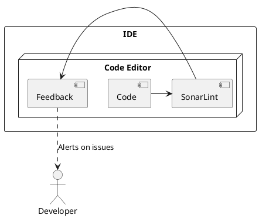
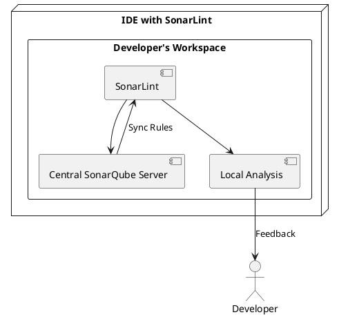
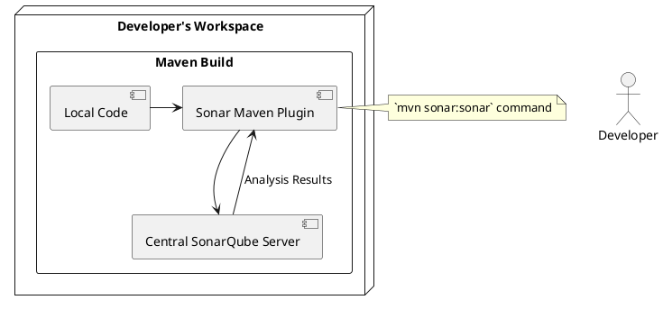

# Enhancing Code Quality through Integrated Tools

## Introduction

This document explores the integration and benefits of SonarLint, SonarQube, and JaCoCo in enhancing code quality within the software development lifecycle. These tools are critical for implementing a shift-left strategy to identify and resolve code quality issues early in the development process.

## 1. SonarLint Integration

### Overview

SonarLint is an IDE plugin that provides real-time feedback on code quality directly in the developer's workspace, supporting major IDEs like Visual Studio, Eclipse, IntelliJ IDEA, and VS Code.

### How It Works

SonarLint operates in standalone and connected modes, providing immediate code quality feedback based on predefined or synchronized rules from SonarQube or SonarCloud.

### Benefits

- **Immediate Feedback**: Quick identification and correction of coding errors.
- **Enhanced Learning**: Continuous education on coding best practices.
- **Increased Efficiency**: Reduction in time needed for code reviews and testing.

### Best Practices

- Regularly update the IDE plugin to leverage the latest rule sets and features.
- Use connected mode to ensure consistency in coding standards across the development team.

### Simplified Diagram Description

## 2. SonarLint Connected Mode with Central SonarQube

### Overview

Connected Mode synchronizes SonarLint with a central SonarQube server, aligning local development environments with central coding standards.

### Benefits

- **Consistency Across Team**: Uniform coding standards across all developers.
- **Central Management of Rules**: Centralized updates and management of coding rules.
- **Seamless Integration with CI/CD**: Enhances code quality prior to integration and deployment stages.

### Troubleshooting Guide

- Ensure the network connectivity between the IDE and the SonarQube server is stable.
- Check for compatibility issues between the versions of SonarLint and SonarQube.

### Simplified Diagram Description

## 3. SonarQube Integration Using Maven Plugin in Local Development Environments

### Overview

Developers use the Sonar Maven plugin to run local analysis against a central SonarQube server, enabling continuous code quality checks directly from the local workspace.

### How It Works

Configure the Sonar Maven plugin in `pom.xml` and use the `mvn sonar:sonar` command to perform code quality analysis, syncing results with the central server.

### Benefits

- **Local Quality Checks**: Immediate feedback on code quality during development.
- **Direct Integration with Development Workflow**: Seamless integration into the Maven build lifecycle.
- **Centralized Configuration**: Maintains consistency with centralized code quality standards.

### Performance Implications

- Analysis may increase build times; optimizing the Maven build configuration can help mitigate this.
- Consider selectively running full analyses to balance build performance and thoroughness.

### Simplified Diagram Description

## 4. JaCoCo Test Report Integration

### Overview

JaCoCo is a Java code coverage tool that integrates into CI/CD pipelines, providing insights into test coverage and identifying under-tested areas.

### How It Works

JaCoCo monitors which parts of the codebase are executed during tests, generating detailed coverage reports.

### Benefits

- **Detailed Coverage Insights**: Enhances understanding of test coverage.
- **Risk Mitigation**: Prioritizes testing efforts on uncovered areas, reducing bugs.
- **Quality Assurance**: Supports high-quality, reliable code through thorough testing.

### Integration with Other Tools

JaCoCo can be integrated with tools like Jenkins, Maven, and other CI/CD tools to enhance test coverage analysis.
